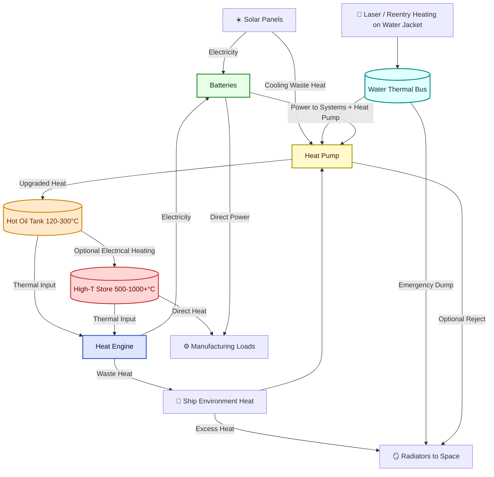

# Hybrid Thermal–Electrical Energy System for Spacecraft  
*A conceptual architecture for harvesting, storing, and reusing waste heat and solar energy for propulsion, manufacturing, and life support.*

---

## 1. Core Concept

The system integrates **solar panels, heat pumps, thermal storage, heat engines, and batteries** into a closed-loop energy–thermal management cycle.  

- **Solar panels** → primary electrical source.  
- **Heat pump** → harvests low-grade heat (solar panel cooling, cabin, avionics, ship water jacket).  
- **Thermal storage** (oil tank, optional high-temperature store) → buffer and upgrade heat.  
- **Heat engine** → converts stored heat into electricity when useful.  
- **Batteries** → central buffer for electrical power.  
- **Ship water jacket** → multifunctional layer for cooling, heat capture, and emergency/radiator mode.  
- **Radiators** → final sink for unrecoverable heat.  

👉 The system is designed to *recycle as much heat as possible* before dumping to space.  
👉 In the best case, **all excess heat becomes stored energy in batteries**; radiators are used only when capacity is exceeded.  

---

## 2. High-Level Architecture

### Mermaid System Diagram

---

## 3. Inputs to the System

1. **Solar Panels**
   - Electrical generation for **batteries** and **heat pump operation**.  
   - Waste heat (from PV cooling) captured by HP.  

2. **Spaceship Environment Heat**
   - Avionics, life support, cabin, and industrial processes.  
   - Normally waste → now harvested by HP.  

3. **Laser / Directed Energy Input**
   - Absorbed by **water jacket** → converted to usable thermal energy.  
   - Dual-use: defense (against “laser attack”), emergency reentry heating buffer, and remote recharging via laser.  

4. **Industrial Waste Heat**
   - From manufacturing (smelting, processing).  
   - Fed into **high-T store** or back to environment loop.  

---

## 4. Outputs from the System

1. **Batteries (Main Output)**
   - Store solar-generated and heat-engine-generated electricity.  
   - Supply all spacecraft systems and manufacturing loads.  
   - In **best case**, all excess thermal energy ends up as stored electric.  

2. **Manufacturing Heat (High-T Direct Use)**
   - Induction, resistive, or plasma melting.  
   - High-T store supports **preheating, calcining, thermal processing**.  

3. **Thermal Comfort & Domestic Needs**
   - Cabin/environmental heating, water heating, laundry, drying.  

4. **Radiators (Final Dump)**
   - When stores/batteries are full and heat can’t be reused, excess is dumped to space.  
   - **Emergency path:** ship walls piped with water → radiative surface.  

---

## 5. Thermal Layers

| Layer             | Typical Temp | Function                                           | Medium                  |
|-------------------|--------------|---------------------------------------------------|-------------------------|
| **Cold Bus**      | 40–60 °C     | PV cooling, cabin, water jacket, laser/reentry input | Water/Ammonia loops     |
| **Mid-T Storage** | 120–300 °C   | General process heat, feed to engine              | Thermal oil tank        |
| **High-T Store**  | 500–1000+ °C | Industrial heat, extended engine power, metal melts | Molten salts, tin, ceramics |
| **Radiators**     | ≥300 K       | Final waste heat rejection to space               | Heat pipes + radiator fins |

---

## 6. Applications

- **Energy Management**
  - Store PV surplus as heat (oil or molten salt).  
  - Run heat engine during eclipse to extend battery runtime.  
  - Use heat pump to *harvest + upgrade waste heat*.  

- **Defense / Survival**
  - Laser attack → absorbed in water jacket → stored as usable heat.  
  - Reentry → jacket acts as heat sink + shield.  

- **Manufacturing**
  - Smelting, alloying, forging (direct electric heating).  
  - Preheating feedstock via oil tank or high-T store.  
  - Use waste industrial heat to recharge high-T store.  

- **Life Support**
  - Cabin temperature stabilization.  
  - Hot water supply.  
  - Food prep, laundry, drying.  

- **Efficiency Boosts**
  - PV cooling by HP → higher PV efficiency.  
  - Radiator area reduction by rejecting hotter HP output.  

---

## 7. Nuances & Options

- **Battery Priority:**  
  - Always fill batteries first with solar electricity.  
  - Only run heat pump if electricity is surplus or cooling required.  

- **Heat Pump COP Tuning:**  
  - Operate at highest possible COP (low lift).  
  - Only “up-pump” to high temps when displacing direct electric heating.  

- **Heat Engine Timing:**  
  - Run only when thermal storage has a healthy ΔT.  
  - Can also run during eclipse to trickle-charge batteries.  

- **Overheat Handling:**  
  - Excess heat → pump into ship walls → radiate to space.  
  - Prioritize battery storage, then high-T store, then radiators.  

- **Materials Selection:**  
  - Water loop: stainless/Ti alloys.  
  - Oil loop: synthetic thermal oil up to ~300 °C.  
  - High-T store: molten nitrate salts (565 °C), chloride salts (700–800 °C), or liquid tin/ceramics (>1000 °C).  

---

## 8. Best-Case Scenario

- **All solar + waste heat collected.**  
- **Batteries charged first.**  
- **Excess heat upgraded and stored in oil/high-T tanks.**  
- **Heat engine recycles storage heat → extra electricity.**  
- **Only when every buffer is full** → heat is finally sent to **ship wall radiators**.  

---

✅ This architecture **recycles nearly every watt of energy twice** (electrical and thermal) before losing it to space.  
✅ It’s flexible: works in sun, eclipse, reentry, or even under laser irradiation.  
✅ It supports both **crew survival** and **industrial manufacturing** on long-duration missions.  