# Multipurpose Closed-Loop Refinery
*A single chemical plant that turns sunlight, water, and any carbon-bearing input into fuel, oxygen, water, and fertilizer. The same manifold serves grid balancing on Earth, life support and propellant on a spaceship, and in-situ resource utilization on the Moon, Mars, and Venus.*

Companion to [Hybrid Thermal–Electrical Energy System](ENERGY.md), which supplies the electricity and the heat buses this refinery runs on.

---

## 1. Naming and category

The industry term for the Earth version is **Power-to-X** (P2X): electricity into a storable chemical. The space version is **ISRU**, in-situ resource utilization, combined with **ECLSS**, environmental control and life support. This document treats them as one design because the chemistry is identical. The distinguishing feature of this concept is that carbon, oxygen, and water each run in a **closed loop** and the plant chooses its product by opening one valve on a shared reactor manifold.

Working name: **Closed-Carbon Multi-Fuel Refinery (CCMR)**. Descriptive name: integrated Power-to-Fuel and fuel-to-power plant with a closed carbon loop and a product manifold.

No one sells this as a packaged unit. Every block below exists commercially or has flown. The combination behind one shared front end with the CO2 return path is the new part.

---

## 2. Core principle: three loops, one import

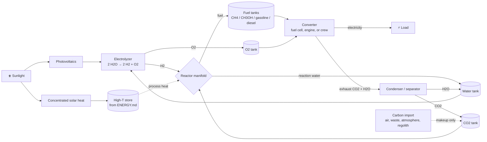

**Why every loop closes exactly.** Fuel synthesis takes CO2 and hydrogen and gives fuel plus water. Burning the fuel in pure oxygen gives back CO2 and water. By element conservation the day side is net `H2O → H2 + ½ O2` and the night side is the reverse. Oxygen produced equals oxygen consumed for **any** fuel, so there is never an oxygen surplus and the exhaust is always pure enough to recycle.

Per kilogram of methanol the balance is:

| Stream | kg | Direction |
|---|---|---|
| Water to electrolyzer | 1.69 | in |
| Hydrogen | 0.19 | electrolyzer → reactor |
| Oxygen | 1.50 | electrolyzer → tank → converter |
| CO2 | 1.37 | tank → reactor, converter → tank |
| Reaction water | 0.56 | reactor → water tank |
| Condensed water | 1.13 | converter → water tank |

Water in equals water out. Oxygen in equals oxygen out. CO2 in equals CO2 out. Only leaks need makeup.

**Energy per kilogram of methanol, Earth grid case**

| Step | kWh |
|---|---|
| Electrolysis | 10 in |
| Reactor compression and heat, net of recovery | 0.5 in |
| CO2 recompression | 0.15 in |
| Converter output at 50 % (SOFC) | 2.8 out |
| Round trip | ~25 % |

The round trip is poor compared with a battery. The plant wins on **duration** (months in a plain tank), on **product value** (fuel and fertilizer sell), and off Earth on **oxygen recovery**, which batteries cannot do at all.

---

## 3. Building blocks

Each block is a standard unit. Conditions are typical, not limits.

| Block | Reaction | Conditions | Catalyst | Maturity | Precedent |
|---|---|---|---|---|---|
| PEM / alkaline electrolyzer | 2 H2O → 2 H2 + O2 | 60–80 °C, 30 bar | Pt / Ni | Commercial | Every green H2 plant |
| Solid oxide electrolyzer (SOEC) | H2O → H2 + ½ O2, CO2 → CO + ½ O2 | 700–850 °C | Ni-YSZ | Commercial, flown on Mars | [MOXIE](https://www.science.org/doi/10.1126/sciadv.abp8636) |
| Co-electrolysis | H2O + CO2 → H2 + CO + O2 | 800 °C | Ni-YSZ | Pilot | OxEon Mars ISRU breadboard |
| Sabatier methanation | CO2 + 4 H2 → CH4 + 2 H2O, −165 kJ | 300–400 °C, 1–30 bar | Ni / Ru | Flying since 2011 | [ISS CRA](https://ntrs.nasa.gov/citations/20100033195) |
| Biological methanation | CO2 + 4 H2 → CH4 + 2 H2O | 65 °C, 10 bar | Archaea | Commercial | [Electrochaea BioCat](https://www.electrochaea.com/technology/) |
| Methanol synthesis | CO2 + 3 H2 → CH3OH + H2O, −49 kJ | 220–280 °C, 50–100 bar | Cu/ZnO/Al2O3 | Commercial | [CRI George Olah plant](https://carbonrecycling.com/projects/george-olah) |
| Reverse water-gas shift (RWGS) | CO2 + H2 → CO + H2O, +41 kJ | 600–900 °C | Cu, Ni, Fe | Commercial | Series-Bosch stage 1 |
| Fischer-Tropsch (FT) | n CO + 2n H2 → (CH2)n + n H2O, −165 kJ/CH2 | 200–250 °C, 20–40 bar | Co / Fe | Commercial | Sunfire, Infinium, Synhelion |
| Methanol-to-gasoline (MTG) | n CH3OH → (CH2)n + n H2O | 350–400 °C, 20 bar | ZSM-5 zeolite | Commercial | ExxonMobil, [HIF Haru Oni](https://hydrogencouncil.com/en/haru-oni-fuel-from-wind-and-water/) |
| Methanol-to-olefins / jet (MTO, MTJ) | CH3OH → C2–C4 olefins → oligomerize → hydrotreat | 400–500 °C | SAPO-34, then acid | Commercial (MTO), pilot (MTJ) | China MTO plants |
| DME synthesis | 2 CH3OH → CH3OCH3 + H2O | 250–350 °C | γ-Al2O3 | Commercial | Diesel substitute |
| Bosch reaction | CO2 + 2 H2 → C(s) + 2 H2O | 500–700 °C | Fe, Ni, Co | NASA ground tests | [Series-Bosch](https://ntrs.nasa.gov/citations/20120014939) |
| Methane pyrolysis | CH4 → C(s) + 2 H2 | 1000 °C or plasma | none / Ni | NASA prototype | [Plasma Pyrolysis Assembly](https://ntrs.nasa.gov/citations/20100036570) |
| Haber-Bosch | N2 + 3 H2 → 2 NH3, −92 kJ | 400–500 °C, 150–300 bar | Fe / Ru | Commercial | Every fertilizer plant |
| Ammonia cracking | 2 NH3 → N2 + 3 H2 | 500–700 °C | Ni / Ru | Commercial | Amogy |
| Oxy-fuel combustion | fuel + O2 → CO2 + H2O | any | none | Commercial | Oxy-fuel boilers, rocket engines |
| Solid oxide fuel cell (SOFC) | fuel + O2 → CO2 + H2O + e⁻ | 700 °C | Ni-YSZ | Commercial | Bloom, [Reverion](https://techfornetzero.org/en/portfolio/reverion/) |
| Methanol reformer + PEM | CH3OH + H2O → 3 H2 + CO2, then H2 + ½ O2 | 250 °C then 80 °C | Cu/ZnO then Pt | Commercial | Blue World Technologies |
| Direct methanol fuel cell (DMFC) | CH3OH + 1.5 O2 → CO2 + 2 H2O | 60–90 °C | Pt-Ru | Commercial, small | Portable power |
| Direct ammonia fuel cell | 4 NH3 + 3 O2 → 2 N2 + 6 H2O | 60–700 °C | varies | Early commercial | GenCell |
| Solar thermochemical splitting | CO2 + H2O → CO + H2 + O2 via ceria redox | 1500 °C reduce, 900 °C oxidize | CeO2 | Pilot | [ETH Zurich mini-refinery](https://ethz.ch/en/news-and-events/eth-news/news/2019/06/pr-solar-mini-refinery.html) |
| Solar gasification | C + H2O → CO + H2, +131 kJ | 900–1300 °C, solar heat | none | Pilot 150 kW | [Steinfeld / PSI](https://pubs.acs.org/doi/10.1021/ef4008399), [Sundrop Fuels](https://www.technologyreview.com/2010/03/10/205466/gasifying-biomass-with-sunlight/) |
| Solar reforming | CH4 + CO2 → 2 CO + 2 H2, CH4 + H2O → CO + 3 H2 | 1000–1200 °C | Ni | Industrial demo | [Synhelion DAWN](https://synhelion.com/our-plants) |
| Anaerobic digestion | 2 (CH2O) → CH4 + CO2 | 35–55 °C | Bacteria | Commercial | Every biogas plant |
| Supercritical water oxidation | waste + O2 → CO2 + H2O + ash | 400–600 °C, 250 bar | none | Pilot | NASA life support studies |
| Trash-to-gas pyrolysis | waste → CH4 + H2 + CO + CO2 | 500–1000 °C | none | Flown suborbital | [NASA OSCAR](https://ntrs.nasa.gov/citations/20220009118) |
| Hydrothermal gasification | wet biomass → CH4 + H2 + CO2 | 400–600 °C, 250 bar | Ru | Pilot | PSI, KIT |
| Membrane nitrogen separation | air → N2 + (O2, CO2, H2O) | 7–13 bar or vacuum | hollow fiber | Commercial | Every N2 generator |
| Pressure swing adsorption | air → N2 or O2 | 6–10 bar | carbon molecular sieve / zeolite | Commercial | Medical O2, industrial N2 |
| Direct air capture, amine TSA | CO2 capture at ambient, release at 80–100 °C | low pressure | solid amine | Commercial | Climeworks |
| Direct air capture, moisture swing | capture dry, release wet | passive | quaternary ammonium resin | Pilot | [Lackner et al.](https://www.sciencedirect.com/science/article/pii/S1876610213007819) |
| Direct air capture, electro-swing | capture charged, release discharged | ambient | quinone electrodes | Pilot | Verdox, Mission Zero |
| Ilmenite hydrogen reduction | FeTiO3 + H2 → Fe + TiO2 + H2O | 900–1000 °C | none | Lab, lunar target | NASA / ESA ISRU |
| Molten regolith electrolysis | MeO → Me + ½ O2 | 1600 °C | none | Lab | MIT, NASA |
| Ram intake with cryotrap | directed gas beam → condensed N2, O2, CO2, H2O | 7–8 km/s, 120–200 km, 20–70 K panel | none | Ground-tested intake, PROFAC study | [ESA / SITAEL RAM-EP](https://www.esa.int/Enabling_Support/Space_Engineering_Technology/World-first_firing_of_air-breathing_electric_thruster) |
| Aerogel dust capture | hypervelocity grains stopped intact | ≤ 6 km/s, 0.01–0.05 g/cm³ silica aerogel | none | Flown, samples returned | [Stardust](https://agupubs.onlinelibrary.wiley.com/doi/full/10.1029/2003JE002087) |
| Knudsen compressor | thermal transpiration moves rarefied gas cold → hot | ΔT along narrow channel, no moving parts | none | Lab devices | Vacuum microtechnology |
| Sulfuric acid decomposition | H2SO4 → H2O + SO3, SO3 → SO2 + ½ O2 | 350–900 °C | Pt / Fe2O3 | Commercial (S-I cycle) | Venus water source |

---

## 4. Product manifold

Hydrogen and CO2 enter one header. One valve per product.

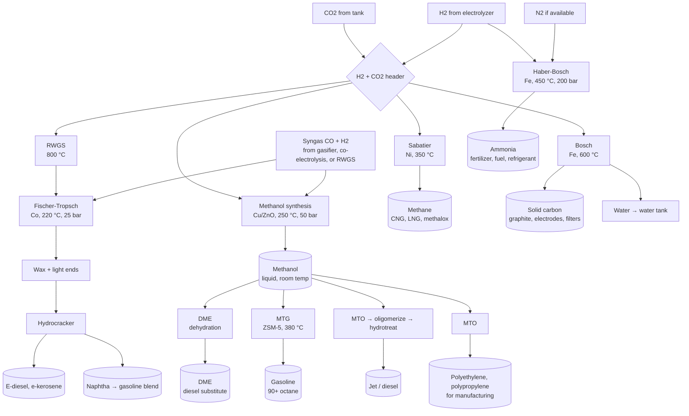

**Product comparison**

| Product | Route | Maturity | Fuel energy per kg | Storage | H2 per C atom | Best role |
|---|---|---|---|---|---|---|
| Methane | Sabatier | Flying | 13.9 kWh | gas grid, cryogenic | 4 | Rocket fuel with LOX, gas grid, simplest reactor |
| Methanol | Cu/ZnO | Commercial | 5.5 kWh | plain tank | 3 | Short-term storage, chemical hub, ship fuel |
| DME | from methanol | Commercial | 8.0 kWh | LPG-type tank | 3 | Diesel engines, cooking gas |
| Gasoline | MTG | Commercial | 12.0 kWh | plain tank | 2 | Existing engines |
| Diesel, jet | FT or MTJ | Commercial | 11.9 kWh | plain tank for years | 2 | Long-term reserve, aviation, trucks |
| Polyolefins | MTO | Commercial | not a fuel | solid | 2 | 3D printing, radiation shielding, packaging |
| Solid carbon | Bosch | NASA tests | not a fuel | solid | 0 net | Oxygen recovery with zero hydrogen loss |
| Ammonia | Haber-Bosch | Commercial | 5.2 kWh | 10 bar liquid | needs N2 | Fertilizer, carbon-free fuel, where N2 exists |
| Hydrogen | electrolysis only | Commercial | 33.3 kWh | 700 bar or 20 K | — | Highest specific impulse, hardest to store |

**Choosing a hub.** Methanol is the natural hub: gasoline, jet, diesel, DME, and polymers each need one extra reactor downstream of it, and methanol is a product on its own. Fischer-Tropsch is a second hub with better diesel quality but needs syngas from RWGS at 800 °C or from co-electrolysis. Sabatier is a separate, simpler branch. A small plant builds the methanol hub first and adds branches.

---

## 5. Use case: Earth, grid balancing and CO2 drawdown

### 5.1 Baseline, closed-carbon methanol battery

Solar surplus charges the plant by day. Grid demand discharges it at night or in winter. Air is touched only by a small CO2 makeup sorbent.

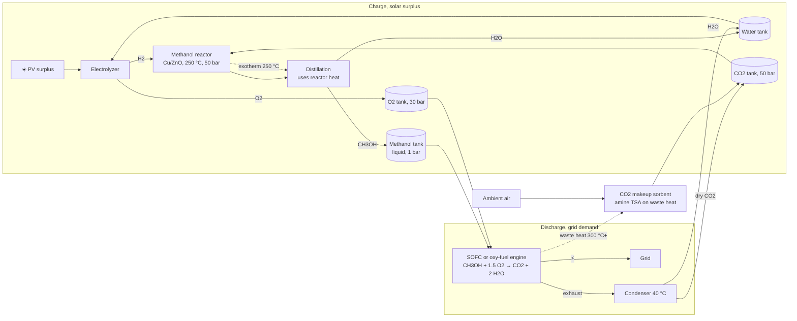

**What it does for the grid.** Absorbs curtailed solar that would otherwise be wasted, returns power on demand, and holds energy for months at no standing loss.

**What it does for CO2.** The loop is carbon-neutral by itself. It becomes carbon-negative only if some product is sold and locked away: methanol into chemicals, polyolefins into durable goods, or solid carbon from a Bosch branch. Every tonne of product exported forces a tonne-equivalent of CO2 makeup drawn from air or from a biogenic source.

### 5.2 Variant, biowaste digester as carbon source

Air capture is the most expensive block. A digester delivers CO2 at 40 % concentration, a thousand times richer than air, and adds free methane.

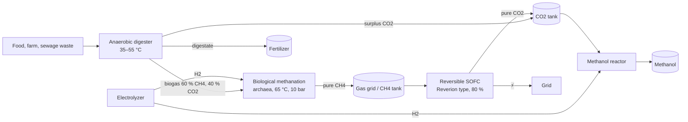

Precedent: [BioCat Avedøre](https://www.electrochaea.com/technology/) in Denmark, the Audi e-gas plant, and [Reverion](https://thenextweb.com/news/german-startup-secures-62m-for-carbon-negative-biogas-power-plants) reversible cells that return pure CO2 from biogas.

### 5.3 Variant, solar thermal gasifier

Concentrated sunlight supplies the gasification heat, so no feedstock is burned and syngas leaves with up to 1.3 times the input heating value.

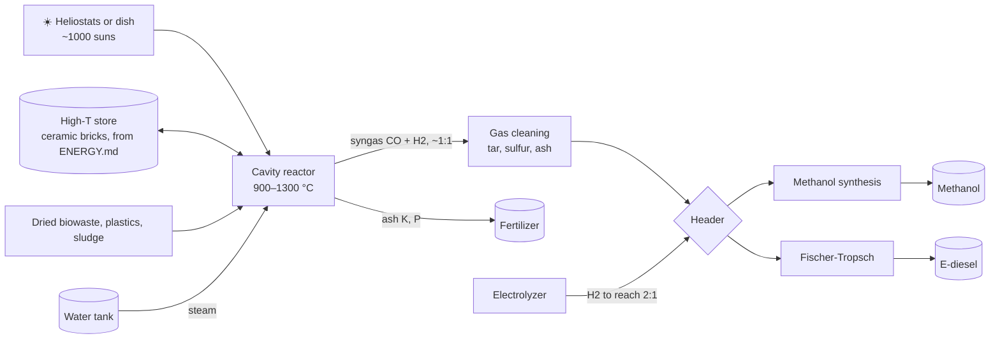

Precedent: [Synhelion DAWN](https://synhelion.com/our-plants) in Jülich, operating since 2024 with ceramic thermal storage for 24-hour reactor operation, and the [150 kW PSI solar gasifier](https://pubs.acs.org/doi/10.1021/ef4008399) that processed sludge, tires, and bagasse. Wet waste can bypass drying through hydrothermal gasification at 250 bar.

### 5.4 Variant, ammonia branch for fertilizer and carbon-free fuel

Ammonia was removed from the baseline because nitrogen fixation needs 450 °C and 200 bar. It returns when the plant is sited next to farmland or a port, because fixed nitrogen sells at 0.4 to 1.2 USD/kg while nitrogen gas is worth cents.

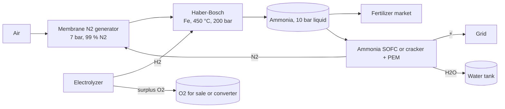

The ammonia branch consumes hydrogen without consuming oxygen, so it is the only branch that creates an oxygen surplus. Argon rides along with nitrogen at 1 % and accumulates in a closed nitrogen loop, so a purge is required.

### 5.5 Alternatives considered and rejected for Earth

| Idea | Why not |
|---|---|
| Single 40–50 °C water-bath chamber that destroys O2 with H2, fixes N2, and degasses CO2 | Nitrogen fixation at 40 °C has no useful yield. Burning H2 to remove O2 wastes the electricity just spent making H2. Ambient CO2 at 0.04 % does not degas from water in useful quantity. |
| Membrane nitrogen removal to "keep O2 and CO2" | A nitrogen membrane leaves CO2 at 0.1 % in the oxygen permeate. It does not concentrate CO2. Electrolyzer O2 is already pure, so no air oxygen is needed. |
| Selling electrolyzer oxygen | Stoichiometry consumes every kilogram at night. Selling it forces air-breathing converters and loses the pure CO2 exhaust. |
| Direct methanol fuel cell at scale | 20–30 % efficiency, high platinum loading. Use SOFC, reformer + PEM, or an oxy-fuel engine. |
| Cryogenic air separation for a small plant | Only economic at large scale and steady load. Membranes and PSA cover makeup streams. |
| Reconverting all fuel to power | Round trip 15–25 %. Sell fuel and fertilizer, and reconvert only at price spikes. |

---

## 6. Use case: spaceship or station, crew as the converter

Crew metabolism is combustion of food with oxygen. The crew **is** the night side. One person per day exhales about 1.0 kg of CO2, consumes 0.84 kg of O2, and produces about 1.5 kg of urine, 0.1 kg dry feces, and 1 to 1.5 kg of trash.

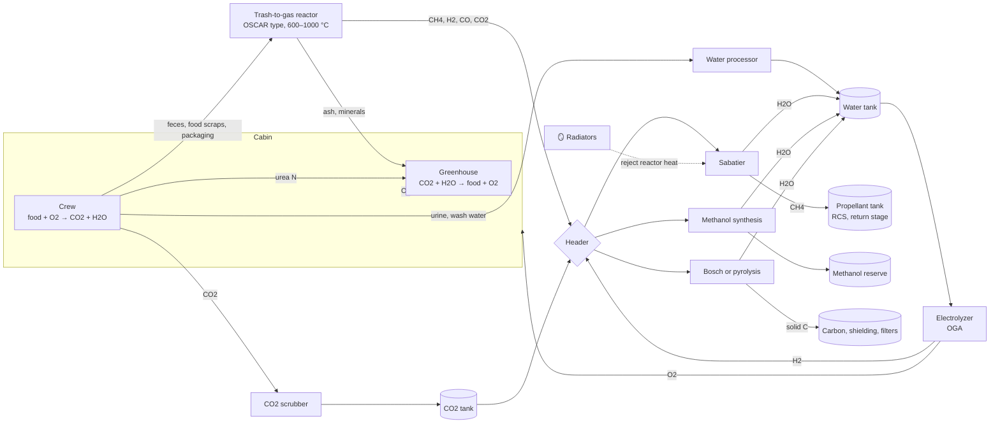

**Net balance per carbon atom, food as the only input**

| Product | Net reaction | Import needed | Free byproduct |
|---|---|---|---|
| Methane | CH2O + H2 → CH4 + ½ O2 | hydrogen, as water | half an O2 per carbon |
| Methanol | CH2O + H2 → CH3OH | hydrogen, as water | none |
| Hydrocarbons, polyolefins | CH2O → CH2 + ½ O2 | nothing | half an O2 per carbon |
| Solid carbon, Bosch | CH2O → C + H2O | nothing | water and all oxygen |

Food already has two hydrogens per carbon. Gasoline, diesel, and polyethylene are therefore hydrogen-neutral. Methane and methanol each need one extra H2 per carbon, which is why the ISS loses hydrogen and needs water resupply.

**Per person per day from 1 kg CO2:** 0.36 kg methane, or 0.73 kg methanol, or 0.32 kg hydrocarbon, or 0.27 kg solid carbon.

**Space-specific rules**

- No gravity for phase separation. Replace distillation and gravity condensers with membrane and centrifugal separators, as the ISS water processor already does.
- Heat rejection is the limit, not power. Reactor exotherms need radiator area. Route them through the water bus and heat pump of [ENERGY.md](ENERGY.md) first.
- Low pressure wins. Sabatier at a few bar flew first. The 50 bar methanol reactor and 20 bar MTG reactor are mass penalties.
- Fischer-Tropsch is too heavy for a ship. Gasoline through MTG is the practical liquid route.
- Cryogenic methane and oxygen liquefy at 111 K and 90 K. Deep-space radiative cooling helps.
- Nothing is vented. Methane goes to a tank instead of overboard. Carbon is precious anywhere without an atmosphere.
- Plants close the loop. Only photosynthesis turns CO2 and water back into food. Everything else here just changes the form of carbon.

Precedents: [ISS Sabatier CRA](https://ntrs.nasa.gov/citations/20100033195) operational since 2011, [NASA OSCAR](https://www.nasa.gov/centers-and-facilities/armstrong/nasa-technology-designed-to-turn-space-trash-into-treasure/) trash-to-gas flown suborbital in 2019, [Series-Bosch](https://ntrs.nasa.gov/citations/20120014939) and the [Plasma Pyrolysis Assembly](https://ntrs.nasa.gov/citations/20100036570) for full hydrogen recovery.

---

## 7. Use case: Moon

**What the Moon offers:** oxygen bound in regolith at about 45 % by mass, water ice in permanently shadowed polar craters, solar-wind hydrogen and carbon at parts per million, sunlight for 14 days followed by 14 days of darkness. **What it lacks:** carbon, nitrogen, and an atmosphere.

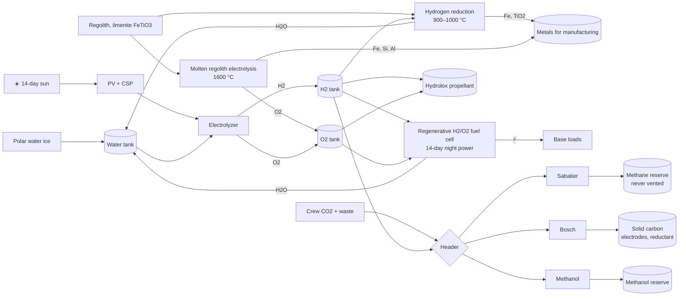

**Design conclusions**

- The grid-balancing role returns. A 354-hour night makes chemical storage necessary again. Hydrogen and oxygen in a regenerative fuel cell is the right pair, because both are made from ice and neither needs carbon.
- Carbon is the scarce element. Every crew CO2 molecule goes to methane, methanol, or solid carbon. Nothing is vented. Solid carbon is also a reductant for regolith metallurgy.
- Oxygen is abundant, hydrogen is the constraint. Ilmenite reduction consumes hydrogen only transiently, since the product water is electrolyzed back.
- Propellant is hydrolox for landers, or methalox if carbon is imported. Oxygen is 80 % of methalox by mass and 86 % of hydrolox, so making only the oxygen locally already saves most of the propellant mass.
- Nitrogen must be imported for cabin buffer gas. Ammonia is off the table.

---

## 8. Use case: Mars

**What Mars offers:** an atmosphere of 95 % CO2 at 6 to 7 mbar, with 2.7 % N2 and 1.6 % Ar, water ice in the regolith at mid and high latitudes, sunlight at 43 % of Earth's, and a cold sink at −60 °C. **Hazards:** dust storms that cut solar power for weeks, perchlorates in soil.

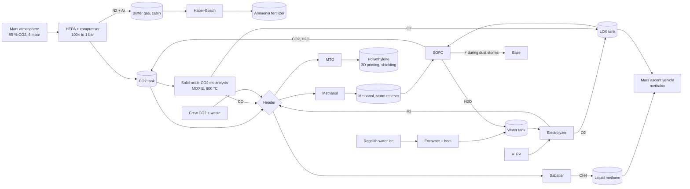

**Design conclusions**

- This is the Zubrin Mars Direct chemistry, now validated on Mars. [MOXIE](https://science.nasa.gov/blog/moxie-sets-consecutive-personal-bests-and-mars-records-for-oxygen-production/) made oxygen at up to 9.8 g/h in 2021 to 2023 by solid oxide electrolysis of atmospheric CO2. OxEon has since built a 33× scaled stack coupled to a methanation reactor.
- Crew CO2 is a rounding error next to the atmosphere. The compressor does the work. Sabatier plus water electrolysis fills the ascent vehicle in about a year at a few hundred kilowatts.
- Fuel is the dust-storm battery. Methanol or methane in tanks with an SOFC covers weeks of low solar, which no battery mass budget can.
- Nitrogen exists, so ammonia fertilizer is possible for greenhouses. Argon is a free buffer gas.
- Polymers are a product. Methanol-to-olefins gives polyethylene for printing parts and for hydrogen-rich radiation shielding.
- Carbon monoxide plus oxygen is a fallback propellant that needs no water at all, at low specific impulse.

---

## 9. Use case: Venus, cloud-level aerostat

**What Venus offers at 50 to 55 km:** pressure of 0.5 to 1 bar, temperature of 20 to 75 °C, gravity 0.9 g, sunlight 1.9× Earth, an atmosphere of 96.5 % CO2 and 3.5 % N2, and sulfuric acid clouds that are the only local hydrogen source. Surface at 460 °C and 92 bar is off limits. This is the [HAVOC](https://www.nasa.gov/general/havoc/) operating regime studied by NASA Langley.

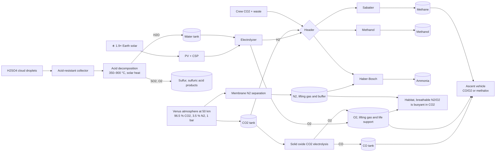

**Design conclusions**

- Carbon and nitrogen are free and unlimited. Hydrogen is the constraint. All hydrogen must come from cloud sulfuric acid or from cargo water. A 1 bar CO2 atmosphere means no compressor at all.
- Breathable air is a lifting gas. Nitrogen and oxygen at 1 bar lift about 0.5 kg per cubic meter in CO2. The habitat's own atmosphere is its balloon, so the oxygen and nitrogen the plant makes are structural products, not just consumables.
- Solid oxide CO2 electrolysis is the primary oxygen source, hydrogen-free. Carbon monoxide plus oxygen is a hydrogen-free propellant.
- Sulfuric acid is corrosive to everything, including solar panels. Fluoropolymer coatings and gold or tantalum wetted parts are required. The acid is also a resource: decomposing it yields water, oxygen, and sulfur.
- Ammonia is attractive here. Nitrogen is local, and ammonia is both fertilizer for a greenhouse and a storable fuel that carries no carbon.
- Waste heat rejection is easy at 1 bar with convection, unlike orbit.

---

## 10. Other environments, brief

| Environment | Carbon | Hydrogen | Oxygen | Nitrogen | Recommended product |
|---|---|---|---|---|---|
| Carbonaceous asteroid | organics, carbonates | hydrated minerals up to 20 % water | from water | trace ammonia salts | Heat regolith to 500 °C for water and CO2, then methane or methanol |
| Titan | methane lakes, ethane, tholins | methane itself | **scarce**, water ice as rock | 95 % N2 atmosphere | Reverse problem: pyrolyze water ice for O2, burn local methane; ammonia from N2 + H2 |
| Europa, Enceladus | CO2, organics in ice | water ice | from water | ammonia traces | Hydrolox propellant, Sabatier from ice CO2 |
| Ceres | carbonates, organics | 25 % water ice | from water | ammonia salts | Water, methane, ammonia all local |
| Earth orbit depot | imported | imported | imported | imported | Reprocess station waste only, methane for RCS |

---

## 11. Intake: orbital scoop, sampler, and deflector

The hull flies through matter everywhere, but it can only harvest where matter is dense enough to matter. Capturing a particle means stopping it in the ship frame. That costs its momentum as drag, `F = ρ v² A`, and dumps its kinetic energy, `½ v²` per kilogram, as heat. Neither cost depends on the shape of the intake.

| Where | Speed | Density | Into a 10 m² mouth | Verdict |
|---|---|---|---|---|
| Earth, 150–180 km | 7.8 km/s | 1e-9 kg/m³ | ~7 kg per day | Build it |
| Venus, 150 km | 7.2 km/s | 1e-9 kg/m³ | ~6 kg per day of CO2 | Build it |
| Mars, 120 km | 3.5 km/s | 1e-9 kg/m³ | ~3 kg per day of CO2 | Build it |
| Enceladus plume | 8 km/s | 1e-9 to 1e-7 kg/m³ | kilograms of water per pass | Build it |
| Comet coma | 10–50 km/s | 1e-10 kg/m³ | grams to kilograms per pass | Sample only |
| Solar wind, 1 AU | 400 km/s | 1e-20 kg/m³ | ~1 mg per year | Useless |
| Interstellar, 0.1 c | 30,000 km/s | 1e-21 kg/m³ | ~10 mg per year | Useless, and a brake |

Kinetic energy per kilogram is 30 MJ at orbital speed, 80 GJ in the solar wind, and 450 TJ at a tenth of light speed. Above roughly 50 km/s incoming atoms bury themselves in the wall as radiation damage instead of stopping on it. The Bussard ramjet failed on exactly these numbers: the scoop's drag exceeds any fusion thrust, which is why the same field is now used backwards as a magnetic sail for braking. The intake below is for atmospheres, plumes, and rings. In cruise it is closed.

### 11.1 Mechanism

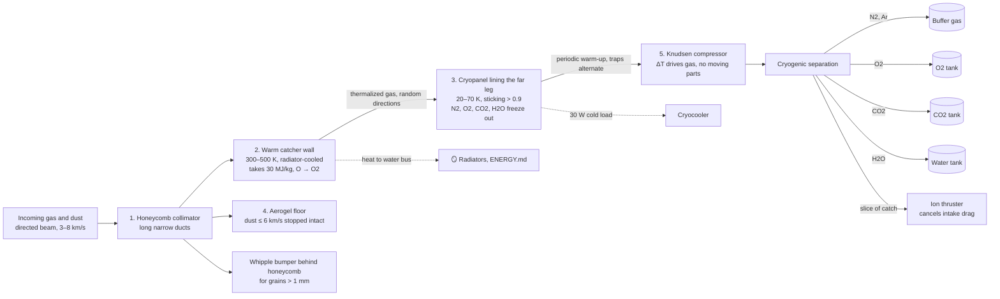

1. **Honeycomb collimator.** A long narrow duct passes a molecule aimed along it with near certainty and passes a random one with a probability of roughly diameter over length. The asymmetry is beam versus thermal, not forward versus backward. This is the ESA and SITAEL intake, tested on the ground in 2017 at simulated 200 km conditions.
2. **Warm catcher wall.** The beam thermalizes here, at the bend of the U. All of the 30 MJ per kilogram of kinetic energy lands on this wall, which is radiator-cooled and costs nothing to run. Atomic oxygen, which arrives at 5 eV and etches polymers, recombines to O2 on a metal or ceramic surface. Never let the beam hit the cold panel directly: chilling 30 MJ per kilogram to 20 K would need about 100 kW of cryocooler power for a 10 m² mouth.
3. **Cryopanel.** Lines the far leg and most of the interior. Thermalized molecules leave the warm wall in random directions and stick on the first cold surface they touch. The escape probability per bounce is about mouth area over total interior area, so 10 m² of mouth against 200 m² of cold surface captures above 90 %. The cold load is only the sensible and latent heat of room-temperature gas, about 0.4 MJ per kilogram, or 30 W at 7 kg per day. Hydrogen and helium do not condense at 20 K and need 4 K or a charcoal sorbent, but at scoop altitudes they are a trace.
4. **Aerogel floor and bumper.** Grains up to a few hundred micrometers at up to 6 km/s stop intact in graded silica aerogel, as Stardust proved in 2004. Anything larger vaporizes on impact and is a shield problem, handled by the honeycomb front acting as a Whipple bumper with the water jacket of [ENERGY.md](ENERGY.md) behind it. Above about 10 km/s dust is not captured by any material.
5. **Regeneration.** The trap fills as ice. Two traps alternate. A warm-up releases the gas, and a Knudsen compressor, a narrow channel with a hot end and a cold end, drives the rarefied gas toward storage by thermal transpiration with no moving parts. The ship's hot and cold buses supply the temperature difference for free.

### 11.2 Two valve modes

- **Molecular flow, continuous mode.** Above about 120 km the mean free path is tens of meters and molecules never touch each other. The cryopanel is the valve. No shutter is needed, and no passive shape can add anything.
- **Continuum flow, gulp mode.** During an aerobraking pass or a plume crossing, density is a million times higher and the gas behaves as a fluid. A cryopanel would be overwhelmed. A pressure sensor at the mouth opens a shutter, the duct fills at ram pressure, and the shutter closes before the gas thermalizes and drifts back out. Thermal speed at 300 K is about 500 m/s, so a 5 m duct empties in about 10 ms and the shutter must close faster than that. The batch is then compressed mechanically. This is the mode for Enceladus, comet comas, and periapsis passes.

### 11.3 Why not a Tesla valve

A Tesla valve makes backflow fight the main flow. That needs a fluid, meaning Reynolds numbers in the hundreds. In molecular flow there is no fluid, only single molecules and walls, and any passive channel transmits a thermalized gas equally in both directions. A shape that let random molecules in but not out would be a Maxwell demon and would run a heat engine off nothing. The serpentine would also obstruct the aimed beam, which is the only thing entering easily. Fractal branching of the cold surface is legitimate as an area multiplier for the cryopanel, which lowers the escape probability per bounce. It is not a diode.

### 11.4 Modes by rotating the U

The U is mounted on a turret and used differently depending on what is ahead.

| Mode | Orientation | What it does |
|---|---|---|
| Collect | mouth forward, cryopanel cold | Continuous molecular capture in low orbit |
| Gulp | mouth forward, shutter armed | Batch capture in dense passes and plumes |
| Sample | mouth forward, aerogel exposed | Intact dust capture below 6 km/s |
| Shield | rotated 180°, convex back forward | Honeycomb and back wall act as Whipple bumper, water jacket behind |
| Deflect | mouth angled 30–60° off the velocity vector | Sheds gas and dust sideways during aerobraking to protect panels and radiators |
| Closed | shutter shut, cryopanel warm | Cruise. Nothing in the path is worth the drag. |
| Brake | magnetic sail deployed, intake closed | Momentum of the medium slows the ship at arrival |

### 11.5 Budget for a 10 m² mouth at 150–180 km

| Item | Value |
|---|---|
| Mass collected | ~7 kg per day |
| Drag | ~0.6 N |
| Heat on warm wall | ~2.4 kW |
| Cold load on cryopanel | ~30 W |
| Ion thruster power to cancel drag at 3000 s | ~18 kW |
| Propellant taken from the catch | ~1.7 kg per day |
| Net stored | ~5 kg per day |
| Energy per net kilogram | ~90 kWh |

The mass is free but slow. Demetriades' 1959 PROFAC study reached the same conclusion with a 10 MW nuclear unit collecting about 40 g/s. Value comes from years of operation and from delivering oxygen, nitrogen, and CO2 to the refinery tanks without a launch. Everything collected at Earth is buffer gas and oxidizer. Everything collected at Venus or Mars is carbon feedstock for the manifold in section 4.

Precedents: [ESA / SITAEL RAM-EP](https://www.esa.int/Enabling_Support/Space_Engineering_Technology/World-first_firing_of_air-breathing_electric_thruster) intake and air-breathing thruster, [PROFAC](https://en.wikipedia.org/wiki/Propulsive_fluid_accumulator) and the Georgia Tech [PHARO](https://mwalker.gatech.edu/papers/IEEE_AerospaceConference_PHARO_2010.pdf) study, and [Stardust](https://agupubs.onlinelibrary.wiley.com/doi/full/10.1029/2003JE002087) aerogel capture.

---

## 12. Scenario matrix

Which block is active where. ● required, ○ optional, — not applicable.

| Block | Earth grid | Earth + biowaste | Ship / station | Moon | Mars | Venus |
|---|---|---|---|---|---|---|
| Water electrolysis | ● | ● | ● | ● | ● | ● |
| Solid oxide CO2 electrolysis | — | — | ○ | — | ● | ● |
| Direct air capture | ● | ○ | — | — | — | — |
| Atmospheric CO2 compressor | — | — | — | — | ● | — |
| Digester + biomethanation | ○ | ● | ○ | — | ○ | — |
| Trash-to-gas / SCWO | — | ○ | ● | ● | ● | ● |
| Solar gasifier | ○ | ● | — | — | — | — |
| Sabatier | ○ | ● | ● | ● | ● | ● |
| Methanol synthesis | ● | ● | ○ | ○ | ● | ● |
| MTG / MTO / MTJ | ○ | ○ | ○ | — | ● polymers | ○ |
| Fischer-Tropsch | ○ | ○ | — | — | — | — |
| Bosch / pyrolysis | — | — | ● | ● | ○ | — |
| Haber-Bosch | ○ | ○ | — | — | ○ | ● |
| Regolith oxygen | — | — | — | ● | — | — |
| Acid decomposition | — | — | — | — | — | ● |
| Regenerative H2/O2 fuel cell | — | — | ○ | ● | ○ | ○ |
| SOFC / oxy-fuel converter | ● | ● | — | ○ | ● | ○ |
| Cryogenic liquefaction | ○ | ○ | ○ | ● | ● | ○ |
| Orbital ram intake | — | — | ● in low orbit | — | ● from orbit | ● from orbit |
| Greenhouse | ○ | ● | ● | ● | ● | ● |

The shared core in every column is the electrolyzer, the water tank, the oxygen tank, the CO2 tank, and the Sabatier and methanol reactors. That is the minimum kit. Everything else is a bolt-on chosen by what the environment supplies.

---

## 13. Design rules

1. **Separate separation from fixation.** No single chamber does both. Membranes or sorbents sort gases at low energy; reactors fix them at high energy.
2. **Take oxygen from the electrolyzer, never from air.** It is already pure and its quantity matches consumption exactly.
3. **Close nitrogen the same way as carbon.** Ammonia fuel cells exhaust pure N2. Recycle it and purge argon.
4. **Use mirrors for heat, panels for electrolysis.** Concentrated solar delivers 1000 °C at 60–70 % efficiency. Electric heat from PV loses three quarters of the sunlight first. Route both through the thermal buses in [ENERGY.md](ENERGY.md).
5. **Recover exotherms.** Sabatier, methanol, and Fischer-Tropsch each release enough heat to run their own distillation and to regenerate sorbents.
6. **Buffer with tanks, not reactors.** A small hydrogen buffer lets the reactor ride through solar dips. Fuel, CO2, O2, and water tanks decouple day from night and summer from winter.
7. **Never vent carbon or hydrogen off Earth.** Both are the scarce elements everywhere except Venus and Titan.
8. **Feed the converter pure oxygen.** The exhaust is then only CO2 and water, which condenses apart with no separation plant.
9. **Pick the lowest pressure that works.** Sabatier at 5 bar before methanol at 50 bar before MTG at 20 bar plus 380 °C. Mass and safety follow pressure.
10. **Match the hydrogen ratio to the product.** Methane 4, methanol 3, hydrocarbons 2, solid carbon 2 with full recovery. Size the electrolyzer for the worst branch.
11. **Treat waste as ore.** Digest what bacteria will eat, gasify the fiber, oxidize the rest. Ash goes to the greenhouse.
12. **Open the intake only where matter is dense.** Low orbit, plumes, rings, and aerobraking passes. In cruise the hull meets radiation and momentum, not feedstock.
13. **Let the product mix follow price and mission phase.** Sell ammonia when fertilizer is dear, make methane when a launch window approaches, make methanol as a standing reserve.

---

## 14. Open questions

- Single-reactor switching: can one Cu/ZnO bed alternate between methanol and DME by temperature alone, or is a second bed always needed?
- Microgravity Fischer-Tropsch: wax handling without gravity has no demonstrated design.
- Venus acid harvesting: collection rate per square meter of collector at 50 km is unmeasured.
- Lunar Bosch carbon: is the solid carbon clean enough to serve as an electrode or reductant without processing?
- Argon in the Mars buffer gas: does it interfere with Haber-Bosch at the 1 % level, or is a purge enough?
- Gulp-mode shutter: what closing time is achievable for a 1 m diameter iris, and does it beat the duct emptying time at plume densities?
- Round-trip target: which converter reaches 60 % on methanol at 100 kW scale, SOFC or reversible SOC?

---

## 15. Sources

**Earth precedents**
- Carbon Recycling International, George Olah plant, CO2 to methanol since 2012: https://carbonrecycling.com/projects/george-olah
- HIF Haru Oni, wind to methanol to gasoline with direct air capture: https://hydrogencouncil.com/en/haru-oni-fuel-from-wind-and-water/ and https://www.greencarcongress.com/2023/09/20230905-haruoni.html
- Synhelion DAWN, solar thermochemical syngas with thermal storage, operating since 2024: https://synhelion.com/our-plants and https://www.solarpaces.org/researchers-create-a-digital-twin-to-run-dawn-synhelions-solar-fuels-plant/
- Electrochaea BioCat, biological methanation at Avedøre: https://www.electrochaea.com/technology/
- Reverion, reversible SOFC with pure CO2 output: https://thenextweb.com/news/german-startup-secures-62m-for-carbon-negative-biogas-power-plants
- ETH Zurich solar mini-refinery, fuel from sunlight and air: https://ethz.ch/en/news-and-events/eth-news/news/2019/06/pr-solar-mini-refinery.html
- Solar gasification of waste feedstocks, 150 kW packed-bed reactor: https://pubs.acs.org/doi/10.1021/ef4008399
- Sundrop Fuels solar biomass gasifier: https://www.technologyreview.com/2010/03/10/205466/gasifying-biomass-with-sunlight/
- Moisture swing sorbent for passive direct air capture, Lackner: https://www.sciencedirect.com/science/article/pii/S1876610213007819

**Space precedents**
- ISS Sabatier Carbon Dioxide Reduction Assembly: https://ntrs.nasa.gov/citations/20100033195
- Sabatier with plasma methane pyrolysis for full hydrogen recovery: https://ntrs.nasa.gov/citations/20100036570
- Series-Bosch CO2 reduction to solid carbon: https://ntrs.nasa.gov/citations/20120014939
- NASA OSCAR trash-to-gas, suborbital test: https://ntrs.nasa.gov/citations/20220009118 and https://www.nasa.gov/centers-and-facilities/armstrong/nasa-technology-designed-to-turn-space-trash-into-treasure/
- MOXIE Mars oxygen ISRU experiment: https://www.science.org/doi/10.1126/sciadv.abp8636 and https://science.nasa.gov/blog/moxie-sets-consecutive-personal-bests-and-mars-records-for-oxygen-production/
- HAVOC, High Altitude Venus Operational Concept: https://www.nasa.gov/general/havoc/ and https://ntrs.nasa.gov/citations/20160006329
- ESA / SITAEL air-breathing electric propulsion, intake and thruster ground test: https://www.esa.int/Enabling_Support/Space_Engineering_Technology/World-first_firing_of_air-breathing_electric_thruster and https://electricrocket.org/2019/886.pdf
- PROFAC, propulsive fluid accumulator, Demetriades 1959: https://en.wikipedia.org/wiki/Propulsive_fluid_accumulator and https://www.osti.gov/biblio/4163348
- PHARO, propellant harvesting of atmospheric resources in orbit, Georgia Tech 2010: https://mwalker.gatech.edu/papers/IEEE_AerospaceConference_PHARO_2010.pdf
- Stardust aerogel capture of comet dust at 6 km/s: https://agupubs.onlinelibrary.wiley.com/doi/full/10.1029/2003JE002087
- Planetary atmosphere data, NASA fact sheets: https://nssdc.gsfc.nasa.gov/planetary/factsheet/
